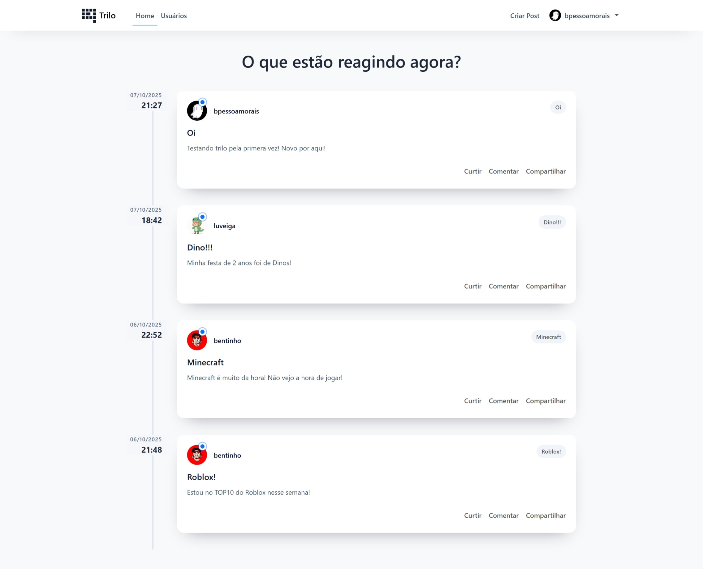
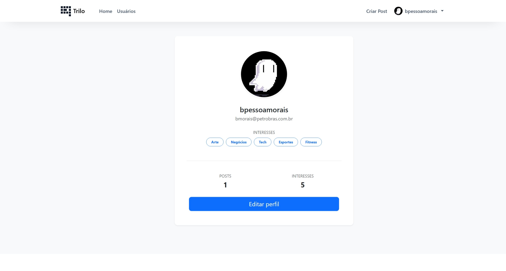
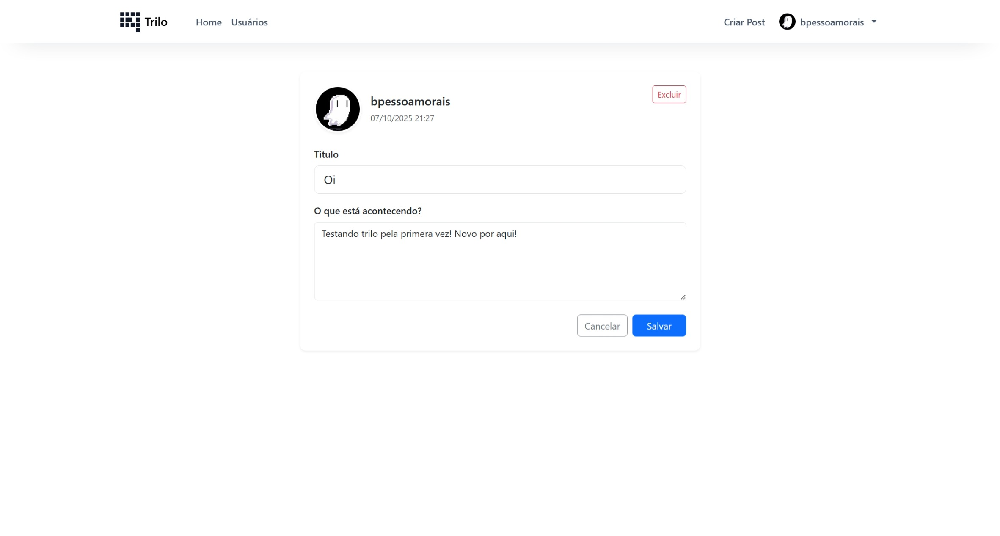

# Trilo · Comunidade Flask

Trilo é uma rede social minimalista construída com Flask para a comunidade. Usuários podem criar posts, editar perfis, escolher interesses e conhecer outros membros. O layout é responsivo com Bootstrap 5 e alguns aprimoramentos de CSS.

<p align="center">
  <!-- Substitua pelos arquivos reais quando tiver as capturas -->
  
</p>

## ✨ Recursos

- Autenticação e sessão com `flask-login`.
- Perfil com avatar, email, interesses e contagem de posts.
- Edição de perfil (upload de foto + seleção de interesses).
- Criação, edição e exclusão de posts (com checagem de autoria).
- Timeline responsiva com cards clicáveis para o detalhe do post.
- Listagem da comunidade com avatar, stats e badges de interesse.

## 🧰 Stack

| Camada        | Tecnologias                                                     |
|---------------|-----------------------------------------------------------------|
| Backend       | Python 3 · Flask · Flask-Login · Flask-WTF · SQLAlchemy         |
| Front-end UI  | Bootstrap 5 · CSS custom (arquivo `comunidade/static/main.css`) |
| Banco de Dados| SQLite                                                          |

## 🚀 Começando

### Pré-requisitos

- Python 3.10+ recomendado.
- (Opcional) Pipenv/virtualenv para isolar dependências.

### Instalação

```bash
# 1. Clone o repositório
git clone https://github.com/<seu-usuario>/trilo.git
cd trilo/site_flask

# 2. Crie o ambiente virtual
python -m venv .venv
# Linux/macOS
source .venv/bin/activate
# Windows (PowerShell)
.venv\Scripts\Activate.ps1

# 3. Instale as dependências
pip install -r requirements.txt  # se não existir, gere depois
```

> Caso não exista `requirements.txt`, gere um com `pip freeze > requirements.txt` depois de instalar Flask e as libs usadas.

### Banco de dados (opcional)

Se o projeto utilizar SQLite local, crie/atualize o banco dentro do contexto da app:

```python
from comunidade import app, database

with app.app_context():
    database.drop_all()
    database.create_all()
```

#### Tabelas

Usuarios

| Coluna      | Tipo         | Restrições            | Default        | Observações                               |
|-------------|--------------|-----------------------|----------------|-------------------------------------------|
| id          | Integer      | PK                    | —              | —                                         |
| username    | String       | NOT NULL              | —              | —                                         |
| email       | String       | NOT NULL, UNIQUE      | —              | —                                         |
| senha       | String       | NOT NULL              | —              | Hash via bcrypt                           |
| foto_perfil | String       | —                     | default.jpg    | Nome do arquivo em static/fotos_perfil    |
| cursos¹     | String       | —                     | Não Informado  | Lista separada por “;” (interesses)       |
| posts       | Relationship | —                     | —              | `db.relationship('Post', backref='autor')`|

¹ Se no seu modelo o campo se chama “interesses” em vez de “cursos”, ajuste o nome.

Posts

| Coluna       | Tipo     | Restrições               | Default             | Observações                    |
|--------------|----------|--------------------------|---------------------|--------------------------------|
| id           | Integer  | PK                       | —                   | —                              |
| titulo       | String   | NOT NULL                 | —                   | —                              |
| corpo        | Text     | NOT NULL, UNIQUE?        | —                   | Avalie se UNIQUE faz sentido   |
| data_criacao | DateTime | NOT NULL                 | `datetime.utcnow`   | Use `default=datetime.utcnow`  |
| id_usuario   | Integer  | NOT NULL, FK(usuario.id) | —                   | Chave estrangeira p/ Usuario   |

### Executando em desenvolvimento

```bash
# na pasta site_flask
export FLASK_APP=main.py      # Windows PowerShell: $Env:FLASK_APP = 'main.py'
export FLASK_ENV=development  # Windows PowerShell: $Env:FLASK_ENV = 'development'
flask run
# App em http://127.0.0.1:5000
```

## 🗂️ Estrutura (visão geral)

```
site_flask/
├── comunidade/
│   ├── static/
│   │   └── fotos_perfil/
│   ├── templates/
│   │   ├── base.html
│   │   ├── contato.html
│   │   ├── criarpost.html
│   │   ├── editarperfil.html
│   │   ├── home.html
│   │   ├── login.html
│   │   ├── navbar.html
│   │   ├── perfil.html
│   │   ├── post.html
│   │   └── usuarios.html
│   ├── __init__.py -> inicializa banco de dados, rotas e app
│   ├── comunidade.db -> banco de dados local sqlite
│   ├── criar_db.py -> cria tabelas no banco de dados
│   ├── forms.py -> formulários utilizados nas páginas html
│   ├── models.py -> tabelas do banco de dados
│   ├── routes.py -> funções de cada rota
|
├── docs/
│   └── screens/
│       ├── home-feed.jpeg
│       ├── perfil.jpeg
│       └── post-detalhe.jpeg
├── main.py -> inicializa o app
└── README.md
```

## 📸 Telas

<p align="center">
  
  
</p>

## 🗺️ Melhorias

- [ ] Comentários e curtidas.
- [ ] Personalização do feed por áreas de interesse
- [ ] Upload de imagens nos posts

## 🤝 Contribuição

1. Faça fork.
2. Crie uma branch: `git checkout -b feature/minha-feature`.
3. Commit: `git commit -m "feat: minha feature"`.
4. Push: `git push origin feature/minha-feature`.
5. Abra um Pull Request.

## 📄 Licença

```
Este projeto está licenciado sob os termos da licença MIT.
```

## 👤 Contato

- Nome: Bruno Pessôa de Morais
- Email: nobrumorais@gmail.com
- LinkedIn/GitHub: <https://www.linkedin.com/in/bruno-pess%C3%B4a-de-morais-aab2597/>
